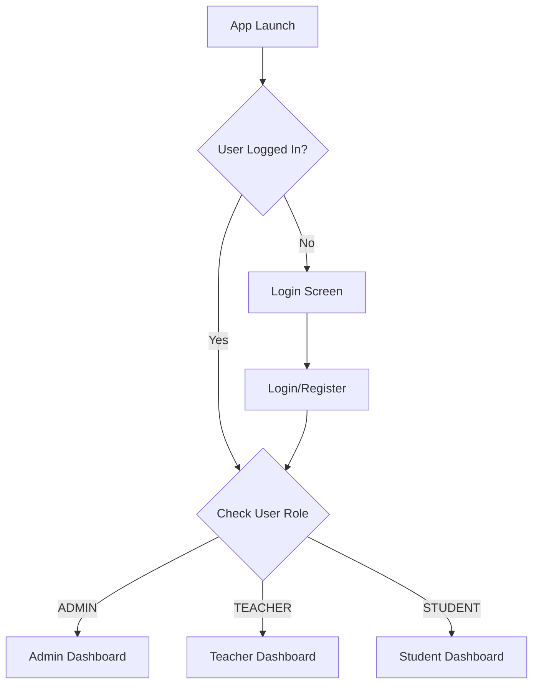

# E-Education Platform

A modern, full-featured Android education platform built with **Jetpack Compose**, **MVVM
architecture**, **Hilt**, and **Firebase**.

## Key Features

### Architecture

- **MVVM Pattern** - Clean separation of concerns
- **Jetpack Compose** - Modern declarative UI
- **Hilt** - Dependency injection
- **Navigation Compose** - Type-safe navigation
- **Coroutines & Flow** - Reactive data streams
- **Firebase Backend** - Auth, Firestore, Storage, ML Kit

### Multi-Role System

#### Admin Dashboard

- User management (Teachers & Students)
- Course oversight
- Platform analytics & reports
- System configuration

#### Teacher Dashboard

- Course creation & management
- AI-powered quiz generation (ML Kit)
- Flashcard creator
- Assignment grading
- Class analytics

#### Student Dashboard

- Course enrollment
- Interactive quizzes
- Flashcard study tools
- Assignment submission
- Progress tracking & achievements

## Tech Stack

### Core

```gradle
- Kotlin 2.0.21
- Jetpack Compose BOM 2024.09.00
- Material3
- Compose Navigation 2.7.6
- Hilt 2.48
- Coroutines 1.7.3
```

### Firebase

```gradle
- Firebase BOM 32.7.0
- Firebase Auth
- Cloud Firestore
- Cloud Storage
- ML Kit (Text Recognition)
- Analytics
```

### Additional

```gradle
- Coil 2.5.0 (Image loading)
- DataStore 1.0.0 (Preferences)
- Kotlinx Serialization 1.6.2
```

## Getting Started

### Prerequisites

- Android Studio Hedgehog or later
- JDK 17
- Android SDK 36
- Firebase account

### Setup Steps

1. **Clone the repository**
   ```bash
   git clone <repository-url>
   cd E_EducationPlatform
   ```

2. **Configure Firebase**
   - Create a Firebase project at [Firebase Console](https://console.firebase.google.com/)
   - Add Android app with package: `com.example.eduverse`
   - Download `google-services.json` and place in `app/` directory
   - Enable Authentication (Email/Password)
   - Create Firestore database
   - Set up Cloud Storage

3. **Build & Run**
   ```bash
   ./gradlew build
   ./gradlew installDebug
   ```

## App Structure

```
app/src/main/java/com/example/eduverse/
├── data/
│   ├── model/
│   │   └── User.kt                    # User model with UserRole enum
│   └── repository/
│       └── AuthRepository.kt          # Firebase Auth repository
├── di/
│   └── AppModule.kt                   # Hilt dependency injection
├── ui/
│   ├── navigation/
│   │   └── NavGraph.kt                # App navigation setup
│   ├── auth/
│   │   ├── AuthViewModel.kt           # Auth state management
│   │   ├── LoginScreen.kt             # Login UI
│   │   └── RegisterScreen.kt          # Registration UI
│   ├── admin/
│   │   └── AdminDashboardScreen.kt    # Admin features
│   ├── teacher/
│   │   └── TeacherDashboardScreen.kt  # Teacher features
│   └── student/
│       └── StudentDashboardScreen.kt  # Student features
├── EduVerseApplication.kt             # App entry with @HiltAndroidApp
└── MainActivity.kt                    # Main activity with navigation
```

## Authentication Flow



## UI Highlights

- **Material Design 3** theming
- **Dynamic color** support
- **Light/Dark mode** compatibility
- **Responsive layouts** for different screen sizes
- **Beautiful animations** and transitions
- **Intuitive navigation** patterns

## Dependencies Configuration

### build.gradle.kts (Project)

```kotlin
plugins {
    alias(libs.plugins.android.application) apply false
    alias(libs.plugins.kotlin.android) apply false
    alias(libs.plugins.kotlin.compose) apply false
    id("com.google.dagger.hilt.android") version "2.48" apply false
    id("com.google.gms.google-services") version "4.4.0" apply false
    id("com.google.devtools.ksp") version "1.9.20-1.0.14" apply false
}
```

### build.gradle.kts (App)

```kotlin
plugins {
    alias(libs.plugins.android.application)
    alias(libs.plugins.kotlin.android)
    alias(libs.plugins.kotlin.compose)
    id("com.google.gms.google-services")
    id("com.google.dagger.hilt.android")
    id("com.google.devtools.ksp")
}

dependencies {
    // Compose BOM + Material3
    implementation(platform(libs.androidx.compose.bom))
    implementation(libs.androidx.material3)
    
    // Hilt
    implementation("com.google.dagger:hilt-android:2.48")
    ksp("com.google.dagger:hilt-android-compiler:2.48")
    
    // Firebase
    implementation(platform("com.google.firebase:firebase-bom:32.7.0"))
    implementation("com.google.firebase:firebase-auth-ktx")
    implementation("com.google.firebase:firebase-firestore-ktx")
    implementation("com.google.firebase:firebase-storage-ktx")
    
    // ML Kit
    implementation("com.google.mlkit:text-recognition:16.0.0")
    
    // Navigation
    implementation("androidx.navigation:navigation-compose:2.7.6")
    
    // Coil
    implementation("io.coil-kt:coil-compose:2.5.0")
}
```

## Testing

Create test users with different roles:

```kotlin
// Via Registration Screen
Admin:   admin@test.com / admin123 / ADMIN
Teacher: teacher@test.com / teacher123 / TEACHER
Student: student@test.com / student123 / STUDENT
```

## Firestore Structure

```
users/
  {userId}/
    - uid: String
    - email: String
    - name: String
    - role: String (ADMIN, TEACHER, STUDENT)
    - profileImageUrl: String
    - createdAt: Long

courses/
  {courseId}/
    - title: String
    - description: String
    - teacherId: String
    - createdAt: Long
```

## Roadmap

- [ ] Email verification
- [ ] Password reset
- [ ] Profile editing
- [ ] Course content management
- [ ] Real-time messaging
- [ ] Video lessons
- [ ] Gamification system
- [ ] Push notifications
- [ ] Offline support

## Documentation

For detailed setup instructions, see [PROJECT_SETUP.md](PROJECT_SETUP.md)

## Contributing

Contributions are welcome! Please feel free to submit a Pull Request.

## License

This project is for educational purposes.

## Author

Built with ❤️ using Jetpack Compose and Firebase

---

# EduVerse - Modern E-Learning Platform

<div align="center">


A modern, feature-rich e-learning platform built with Kotlin, Jetpack Compose, and Material 3
design.

[Features](#features) • [Setup](#setup) • [Architecture](#architecture) • [Documentation](#documentation)

</div>

---

## 🎯 Overview

EduVerse is a comprehensive educational platform that connects teachers and students through an
intuitive, gamified learning experience. The app supports three user roles (Admin, Teacher, Student)
with role-specific dashboards and features.

### Key Highlights

- 📱 **Modern UI/UX** - Material 3 design with full dark mode support
- 🎮 **Gamification** - XP system, levels, streaks, and badge unlocks
- 📚 **Content Management** - Upload and share PDFs, create quizzes and flashcards
- 🤖 **AI-Powered OCR** - Extract text from images using ML Kit
- 🔐 **Secure** - Role-based access control with Firebase Auth
- ☁️ **Cloud-Powered** - Real-time sync with Firestore and Supabase Storage
- 📊 **Progress Tracking** - Detailed analytics and performance monitoring

---

## ✨ Features

### For Students

- ✅ Browse and download educational materials
- ✅ Study with interactive flashcards
- ✅ Take quizzes and track scores
- ✅ Earn XP, level up, and unlock badges
- ✅ Maintain daily learning streaks
- ✅ View detailed progress analytics

### For Teachers

- ✅ Upload PDF and image materials
- ✅ Create custom quizzes with multiple-choice questions
- ✅ Generate flashcards from content
- ✅ Use OCR to extract text from images
- ✅ Monitor student engagement
- ✅ Manage uploaded content

### For Admins

- ✅ User management across all roles
- ✅ Content moderation
- ✅ System-wide analytics
- ✅ Access control management
- ✅ Platform oversight

---

## 🚀 Quick Start

### Prerequisites

- Android Studio Hedgehog (2023.1.1) or newer
- JDK 17 or higher
- Android SDK 34+
- Firebase account (for Auth & Firestore)
- Supabase account (for Storage)

### Installation

1. **Clone the repository**
   ```bash
   git clone https://github.com/yourusername/eduverse.git
   cd eduverse
   ```

2. **Open in Android Studio**
   ```bash
   # Open Android Studio
   # File → Open → Select the 'eduverse' folder
   ```

3. **Sync Gradle**
   ```bash
   # In Android Studio:
   # File → Sync Project with Gradle Files
   ```

4. **Set up Firebase** (see [Firebase Setup Guide](FIREBASE_SETUP_GUIDE.md))
   - Enable Firebase Authentication (Email/Password)
   - Create Firestore Database
   - Apply security rules from the guide

5. **Set up Supabase** (see [Supabase Setup Guide](SUPABASE_STORAGE_SETUP.md))
   - Create Supabase project
   - Get API credentials
   - Update `FirebaseModule.kt` with your credentials
   - Create storage buckets and apply policies

6. **Run the app**
   ```bash
   # In Android Studio:
   # Run → Run 'app'
   # Or press Shift + F10
   ```

---

## 🏗️ Architecture

EduVerse follows Clean Architecture principles with MVVM pattern:

```
┌─────────────────────────────────────────────┐
│              Presentation Layer             │
│   (Jetpack Compose + Material 3 + MVVM)   │
│  ┌──────────┐  ┌──────────┐  ┌──────────┐ │
│  │ Student  │  │ Teacher  │  │  Admin   │ │
│  │Dashboard │  │Dashboard │  │Dashboard │ │
│  └──────────┘  └──────────┘  └──────────┘ │
└─────────────────────────────────────────────┘
                     │
┌─────────────────────────────────────────────┐
│              Domain Layer                   │
│  ┌──────────┐  ┌──────────┐  ┌──────────┐ │
│  │ Use Cases│  │ Models   │  │Repository│ │
│  │          │  │          │  │Interfaces│ │
│  └──────────┘  └──────────┘  └──────────┘ │
└─────────────────────────────────────────────┘
                     │
┌─────────────────────────────────────────────┐
│               Data Layer                    │
│  ┌──────────┐  ┌──────────┐  ┌──────────┐ │
│  │ Firebase │  │ Supabase │  │  ML Kit  │ │
│  │Auth/Store│  │ Storage  │  │   OCR    │ │
│  └──────────┘  └──────────┘  └──────────┘ │
└─────────────────────────────────────────────┘
```

### Tech Stack

**Frontend:**

- Kotlin
- Jetpack Compose
- Material 3 Design System
- Compose Navigation
- Coil (Image Loading)
- Lottie (Animations)

**Backend & Services:**

- Firebase Authentication
- Firebase Firestore (Database)
- Supabase Storage (File Storage)
- Google ML Kit (OCR)

**Architecture & DI:**

- MVVM Pattern
- Clean Architecture
- Hilt (Dependency Injection)
- Kotlin Coroutines & Flow

---

## 📱 Screenshots

<div align="center">

|             Login Screen             |              Student Dashboard               |            Quiz Screen             |
|:------------------------------------:|:--------------------------------------------:|:----------------------------------:|
|  |  |  |

|          XP Progress           |             Streak Counter             |             Badge Unlock             |
|:------------------------------:|:--------------------------------------:|:------------------------------------:|
|  |  |  |

</div>

---

## 📚 Documentation

Comprehensive guides are available in the `/docs` directory:

### Setup Guides

- 📘 [**Firebase Setup Guide**](FIREBASE_SETUP_GUIDE.md) - Complete Firebase configuration
- 📗 [**Supabase Storage Setup**](SUPABASE_STORAGE_SETUP.md) - Storage configuration
- 📙 [**Material 3 Theming Guide**](MATERIAL3_THEMING_GUIDE.md) - UI/UX customization

### Technical Documentation

- 📕 [**Integration Summary**](INTEGRATION_SUMMARY.md) - All integrations overview
- 📔 [**Architecture Guide**](ARCHITECTURE.md) - Detailed architecture docs
- 📓 [**Build Status**](BUILD_STATUS.md) - Build configuration

---

## 🎨 Material 3 Design

EduVerse features a beautiful Material 3 design system:

### Light Mode

- Primary: Deep Blue (#1976D2) - Trust & Knowledge
- Secondary: Teal (#00897B) - Growth & Learning
- Tertiary: Red (#D32F2F) - Energy & Passion

### Dark Mode

- Primary: Light Blue (#90CAF9)
- Secondary: Light Teal (#4DB6AC)
- Tertiary: Light Red (#EF5350)

### Special Components

- **AnimatedXPBar** - Smooth progress tracking with shimmer effects
- **AnimatedStreakCounter** - Fire animation for daily streaks
- **BadgeUnlockAnimation** - Celebration dialog for achievements
- **NavigationBar** - Bottom navigation with animated selection

---

## 🧪 Testing

### Manual Testing

Follow the comprehensive testing guide
in [FIREBASE_SETUP_GUIDE.md](FIREBASE_SETUP_GUIDE.md#testing-instructions)

### Test Accounts

Create test accounts for each role:

```kotlin
// Admin
email: "admin@eduverse.com"
password: "Admin@123"

// Teacher
email: "teacher@eduverse.com"
password: "Teacher@123"

// Student
email: "student@eduverse.com"
password: "Student@123"
```

### Unit Tests

```bash
./gradlew test
```

### UI Tests

```bash
./gradlew connectedAndroidTest
```

---

## 🔒 Security

### Firebase Security

- ✅ Email/password authentication
- ✅ Role-based access control (RBAC)
- ✅ Firestore security rules enforced
- ✅ User data isolation

### Supabase Security

- ✅ Row-level security (RLS) policies
- ✅ Authenticated file uploads
- ✅ Public/private bucket configuration
- ✅ File size and type restrictions

### Best Practices

- Never commit API keys to version control
- Use environment variables for sensitive data
- Implement proper error handling
- Validate all user inputs
- Use HTTPS for all network requests

---

## 💰 Cost Estimation

### Free Tier (Development)

**Firebase:**

- 10,000 monthly active users
- 1GB Firestore storage
- 50,000 reads/day
- Unlimited ML Kit usage

**Supabase:**

- 1GB storage
- 2GB bandwidth/month
- Unlimited API requests

**Total: $0/month** (within free tier limits)

### Production (Estimated)

For 10,000 active users:

- Firebase Blaze: ~$25-50/month
- Supabase Pro: $25/month
- **Total: ~$50-75/month**

---

## 🗺️ Roadmap

### Version 1.0 (Current) ✅

- ✅ Material 3 UI with dark mode
- ✅ Firebase Authentication
- ✅ Firestore Database
- ✅ Supabase Storage
- ✅ ML Kit OCR
- ✅ Gamification system

### Version 1.1 (Q2 2024) 🚧

- [ ] Firebase Analytics integration
- [ ] Crashlytics for error tracking
- [ ] Push notifications
- [ ] Offline mode improvements
- [ ] User profiles with avatars

### Version 2.0 (Q3 2024) 📋

- [ ] AI-powered quiz generation
- [ ] Social features (study groups)
- [ ] Leaderboards
- [ ] Multi-language support
- [ ] Advanced analytics dashboard

### Version 3.0 (Q4 2024) 🔮

- [ ] Video content support
- [ ] Live streaming classes
- [ ] Assignment submission system
- [ ] Grading system
- [ ] Parent portal

---

## 🤝 Contributing

Contributions are welcome! Please follow these steps:

1. Fork the repository
2. Create a feature branch (`git checkout -b feature/AmazingFeature`)
3. Commit your changes (`git commit -m 'Add some AmazingFeature'`)
4. Push to the branch (`git push origin feature/AmazingFeature`)
5. Open a Pull Request

### Development Guidelines

- Follow Kotlin coding conventions
- Use meaningful variable and function names
- Write descriptive commit messages
- Add comments for complex logic
- Update documentation as needed
- Test your changes thoroughly

---

## 📄 License

This project is licensed under the MIT License - see the [LICENSE](LICENSE) file for details.

---

## 👥 Team

- **Developer** - Your Name
- **Designer** - Design Team
- **Project Manager** - PM Team

---

## 🙏 Acknowledgments

- [Material Design 3](https://m3.material.io/) - For the beautiful design system
- [Firebase](https://firebase.google.com/) - For authentication and database
- [Supabase](https://supabase.com/) - For scalable storage solution
- [Google ML Kit](https://developers.google.com/ml-kit) - For OCR capabilities
- [Jetpack Compose](https://developer.android.com/jetpack/compose) - For modern UI toolkit

---

## 📞 Support

- 📧 Email: support@eduverse.com
- 💬 Discord: [Join our community](https://discord.gg/eduverse)
- 🐛 Issues: [GitHub Issues](https://github.com/yourusername/eduverse/issues)
- 📖 Docs: [Documentation](https://eduverse.gitbook.io)

---

## 📊 Project Stats


---

<div align="center">

Made with ❤️ by the EduVerse Team

**[⬆ Back to Top](#eduverse---modern-e-learning-platform)**

</div>

