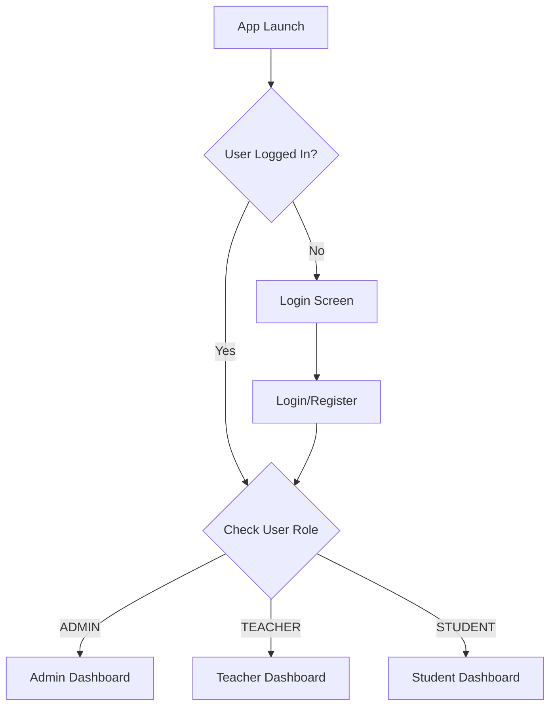

# E-Education Platform

A modern, full-featured Android education platform built with **Jetpack Compose**, **MVVM
architecture**, **Hilt**, and **Firebase**.

## Key Features

### Architecture

- **MVVM Pattern** - Clean separation of concerns
- **Jetpack Compose** - Modern declarative UI
- **Hilt** - Dependency injection
- **Navigation Compose** - Type-safe navigation
- **Coroutines & Flow** - Reactive data streams
- **Firebase Backend** - Auth, Firestore, Storage, ML Kit

### Multi-Role System

#### Admin Dashboard

- User management (Teachers & Students)
- Course oversight
- Platform analytics & reports
- System configuration

#### Teacher Dashboard

- Course creation & management
- AI-powered quiz generation (ML Kit)
- Flashcard creator
- Assignment grading
- Class analytics

#### Student Dashboard

- Course enrollment
- Interactive quizzes
- Flashcard study tools
- Assignment submission
- Progress tracking & achievements

## Tech Stack

### Core

```gradle
- Kotlin 2.0.21
- Jetpack Compose BOM 2024.09.00
- Material3
- Compose Navigation 2.7.6
- Hilt 2.48
- Coroutines 1.7.3
```

### Firebase

```gradle
- Firebase BOM 32.7.0
- Firebase Auth
- Cloud Firestore
- Cloud Storage
- ML Kit (Text Recognition)
- Analytics
```

### Additional

```gradle
- Coil 2.5.0 (Image loading)
- DataStore 1.0.0 (Preferences)
- Kotlinx Serialization 1.6.2
```

## Getting Started

### Prerequisites

- Android Studio Hedgehog or later
- JDK 17
- Android SDK 36
- Firebase account

### Setup Steps

1. **Clone the repository**
   ```bash
   git clone <repository-url>
   cd E_EducationPlatform
   ```

2. **Configure Firebase**
   - Create a Firebase project at [Firebase Console](https://console.firebase.google.com/)
   - Add Android app with package: `com.example.eduverse`
   - Download `google-services.json` and place in `app/` directory
   - Enable Authentication (Email/Password)
   - Create Firestore database
   - Set up Cloud Storage

3. **Build & Run**
   ```bash
   ./gradlew build
   ./gradlew installDebug
   ```

## App Structure

```
app/src/main/java/com/example/eduverse/
├── data/
│   ├── model/
│   │   └── User.kt                    # User model with UserRole enum
│   └── repository/
│       └── AuthRepository.kt          # Firebase Auth repository
├── di/
│   └── AppModule.kt                   # Hilt dependency injection
├── ui/
│   ├── navigation/
│   │   └── NavGraph.kt                # App navigation setup
│   ├── auth/
│   │   ├── AuthViewModel.kt           # Auth state management
│   │   ├── LoginScreen.kt             # Login UI
│   │   └── RegisterScreen.kt          # Registration UI
│   ├── admin/
│   │   └── AdminDashboardScreen.kt    # Admin features
│   ├── teacher/
│   │   └── TeacherDashboardScreen.kt  # Teacher features
│   └── student/
│       └── StudentDashboardScreen.kt  # Student features
├── EduVerseApplication.kt             # App entry with @HiltAndroidApp
└── MainActivity.kt                    # Main activity with navigation
```

## Authentication Flow



## UI Highlights

- **Material Design 3** theming
- **Dynamic color** support
- **Light/Dark mode** compatibility
- **Responsive layouts** for different screen sizes
- **Beautiful animations** and transitions
- **Intuitive navigation** patterns

## Dependencies Configuration

### build.gradle.kts (Project)

```kotlin
plugins {
    alias(libs.plugins.android.application) apply false
    alias(libs.plugins.kotlin.android) apply false
    alias(libs.plugins.kotlin.compose) apply false
    id("com.google.dagger.hilt.android") version "2.48" apply false
    id("com.google.gms.google-services") version "4.4.0" apply false
    id("com.google.devtools.ksp") version "1.9.20-1.0.14" apply false
}
```

### build.gradle.kts (App)

```kotlin
plugins {
    alias(libs.plugins.android.application)
    alias(libs.plugins.kotlin.android)
    alias(libs.plugins.kotlin.compose)
    id("com.google.gms.google-services")
    id("com.google.dagger.hilt.android")
    id("com.google.devtools.ksp")
}

dependencies {
    // Compose BOM + Material3
    implementation(platform(libs.androidx.compose.bom))
    implementation(libs.androidx.material3)
    
    // Hilt
    implementation("com.google.dagger:hilt-android:2.48")
    ksp("com.google.dagger:hilt-android-compiler:2.48")
    
    // Firebase
    implementation(platform("com.google.firebase:firebase-bom:32.7.0"))
    implementation("com.google.firebase:firebase-auth-ktx")
    implementation("com.google.firebase:firebase-firestore-ktx")
    implementation("com.google.firebase:firebase-storage-ktx")
    
    // ML Kit
    implementation("com.google.mlkit:text-recognition:16.0.0")
    
    // Navigation
    implementation("androidx.navigation:navigation-compose:2.7.6")
    
    // Coil
    implementation("io.coil-kt:coil-compose:2.5.0")
}
```

## Testing

Create test users with different roles:

```kotlin
// Via Registration Screen
Admin:   admin@test.com / admin123 / ADMIN
Teacher: teacher@test.com / teacher123 / TEACHER
Student: student@test.com / student123 / STUDENT
```

## Firestore Structure

```
users/
  {userId}/
    - uid: String
    - email: String
    - name: String
    - role: String (ADMIN, TEACHER, STUDENT)
    - profileImageUrl: String
    - createdAt: Long

courses/
  {courseId}/
    - title: String
    - description: String
    - teacherId: String
    - createdAt: Long
```

## Roadmap

- [ ] Email verification
- [ ] Password reset
- [ ] Profile editing
- [ ] Course content management
- [ ] Real-time messaging
- [ ] Video lessons
- [ ] Gamification system
- [ ] Push notifications
- [ ] Offline support

## Documentation

For detailed setup instructions, see [PROJECT_SETUP.md](PROJECT_SETUP.md)

## Contributing

Contributions are welcome! Please feel free to submit a Pull Request.

## License

This project is for educational purposes.

## Author

Built with ❤️ using Jetpack Compose and Firebase

---
